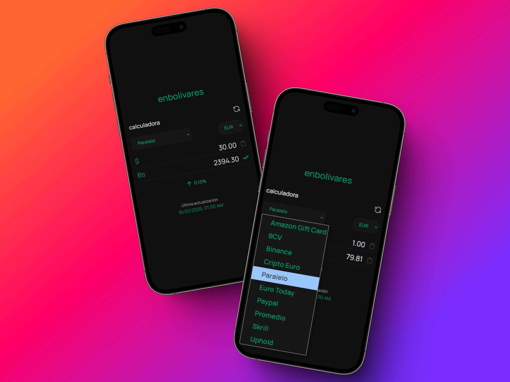

<a href="https://enbolivares.onrender.com/" target="_blank"><h1>enbolivares</h1></a>

  
  

Este proyecto es una página web que permite consultar el precio del dólar y el euro en bolívares y viceversa, utilizando la API de Pydolarvzla. Inspirado en la página https://alcambio.app/ y haciendo algunas mejoras en el diseño y experiencia de usuario.

La página web está alojada en render.com. Puedes acceder a la aplicación en el siguiente enlace: [https://enbolivares.onrender.com/](https://enbolivares.onrender.com/)

## Características

- Consulta en tiempo real los precios del dólar y el euro en bolívares.

- Elige el monitor que deseas seguir, como Enparalelo, BCV, Binance, Paypal o Cripto Dólar, entre otros.
- Ingresa el monto que desees y obtén la conversión a la otra moneda.
- Visualiza el porcentaje de cambio de cada moneda.
- Copia fácilmente el resultado para utilizarlo donde necesites.
- Visualiza la fecha de la última actualización del precio de la moneda.
- Interfaz intuitiva y elegante.

## Tecnologías Utilizadas

- **HTML**

- **CSS**
- **React**
- **TypeScript**
- **API de Pydolarvzla**
- **NodeJS**

## Contribuciones

Las contribuciones son bienvenidas. Si deseas colaborar, por favor abre un issue o envía un pull request con tus cambios propuestos.

## Licencia

Este proyecto está licenciado bajo la Licencia MIT. Consulta el archivo LICENSE para más detalles.

## Contacto

Si tienes alguna pregunta o comentario, no dudes en ponerte en contacto conmigo a través de diego6mm@gmail.com o abre un issue en el repositorio.

---

¡Gracias por visitar y usar esta aplicación! Espero que te sea útil para tus necesidades de consulta de cambio de moneda.
